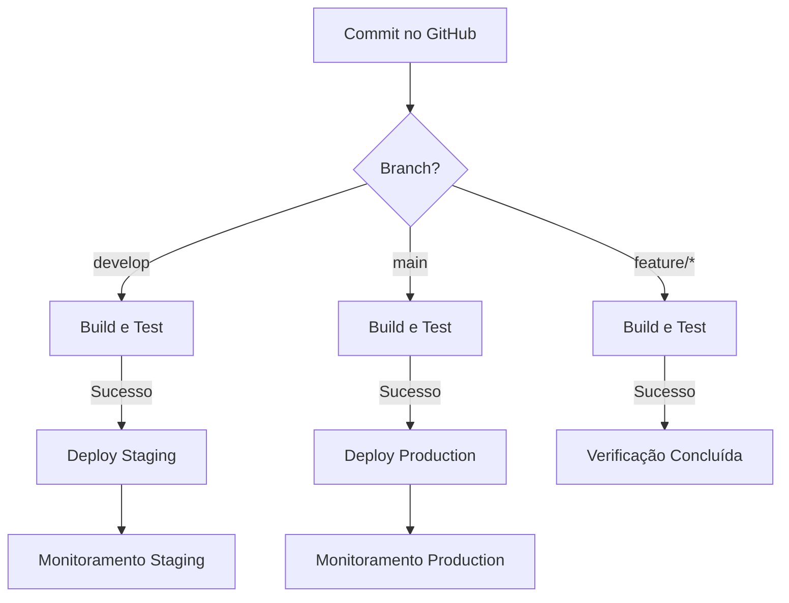
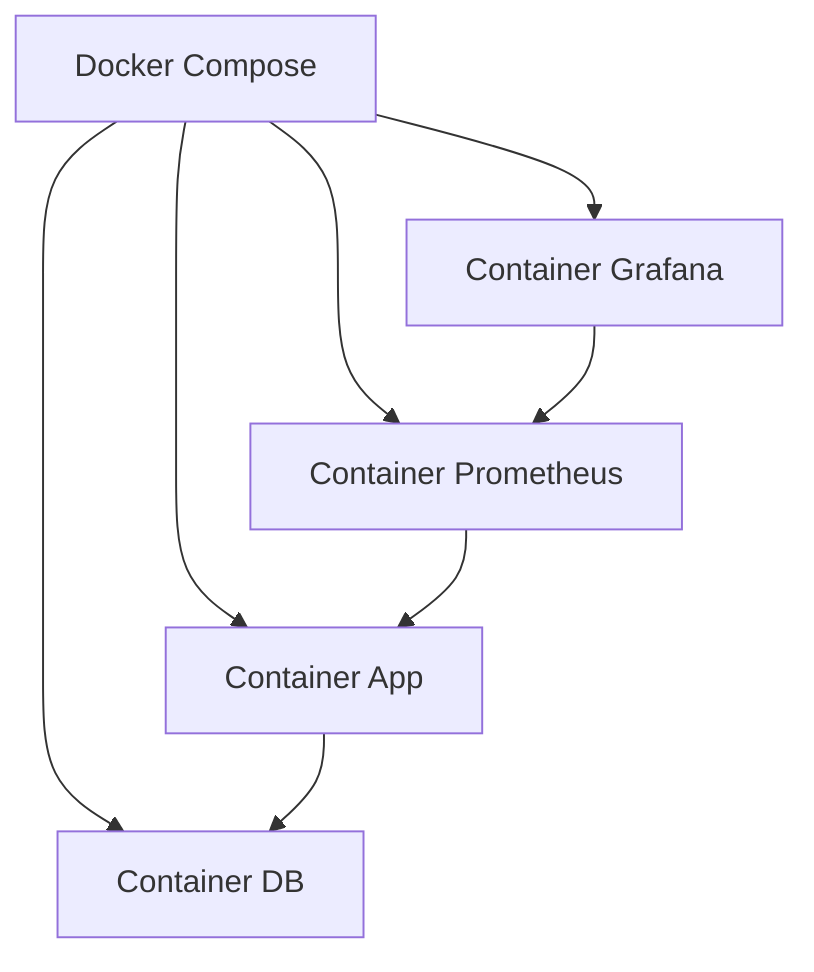

# Pipeline CI/CD - FireWatch03

## Visão Geral

O pipeline CI/CD do FireWatch03 foi projetado para automatizar o processo de build, teste e deploy da aplicação em ambientes de staging e produção. Utilizamos GitHub Actions como a principal ferramenta para orquestrar este pipeline, garantindo que cada commit seja verificado e, quando aprovado, implantado no ambiente apropriado.

## Estrutura do Pipeline

O pipeline está estruturado em três jobs principais:

1. **Build e Test**: Compila o código e executa testes automatizados
2. **Deploy Staging**: Implanta a aplicação no ambiente de staging (quando o código é enviado para a branch develop)
3. **Deploy Production**: Implanta a aplicação no ambiente de produção (quando o código é enviado para a branch main)

## Fluxo Detalhado

### Job: Build e Test

Este job é executado para todos os commits nas branches main e develop, além de Pull Requests direcionadas a estas branches. Os passos incluem:

1. **Checkout do código**: Obtém o código mais recente do repositório
2. **Configuração do JDK 21**: Configura o ambiente Java necessário para compilação
3. **Build com Maven**: Compila o código fonte
4. **Execução de Testes**: Executa testes unitários e de integração
5. **Build da Imagem Docker**: Cria a imagem Docker com a aplicação
6. **Persistência de Artefatos**: Salva a imagem Docker como um artefato para uso nos estágios subsequentes

```yaml
steps:
  - uses: actions/checkout@v3

  - name: Set up JDK 21
    uses: actions/setup-java@v3
    with:
      java-version: '21'
      distribution: 'temurin'
      cache: maven

  - name: Build with Maven
    run: mvn -B clean package

  - name: Run Tests
    run: mvn test
```

### Job: Deploy Staging

Este job é executado apenas quando há commits na branch develop. Seus passos incluem:

1. **Download dos Artefatos**: Recupera a imagem Docker criada no job de build
2. **Configuração do Ambiente de Staging**: Aplica as configurações específicas para o ambiente de staging
3. **Deploy da Aplicação**: Realiza o deploy da aplicação no ambiente de staging

### Job: Deploy Production

Similar ao job de staging, este job é executado apenas para commits na branch main, e segue os mesmos passos mas aplicando configurações específicas para o ambiente de produção.

## Estratégia de Branching

Nossa estratégia de branching segue o modelo GitFlow simplificado:

- **main**: Contém o código em produção
- **develop**: Contém o código que será lançado na próxima release
- **feature/\***: Branches temporárias para desenvolvimento de novas funcionalidades
- **bugfix/\***: Branches temporárias para correção de bugs

## Processo de Entrega Contínua

O pipeline implementa um processo de Entrega Contínua onde:

1. Cada commit é automaticamente testado
2. Os commits na branch develop são automaticamente implantados no ambiente de staging
3. Os commits na branch main são automaticamente implantados no ambiente de produção

## Segurança

Variáveis sensíveis como credenciais de banco de dados e tokens são armazenadas como segredos do repositório e injetadas no pipeline apenas durante a execução, evitando exposição de informações sensíveis.

## Monitoramento

Após o deploy, o pipeline configurará o Prometheus para coletar métricas da aplicação e o Grafana para visualização destas métricas, permitindo monitoramento contínuo da aplicação.

## Diagramas

### Fluxo do Pipeline CI/CD



### Arquitetura de Containers

