# Evidências de Execução - FireWatch03

## 1. Pipeline CI/CD

### 1.1.1 Etapa de Build Staging
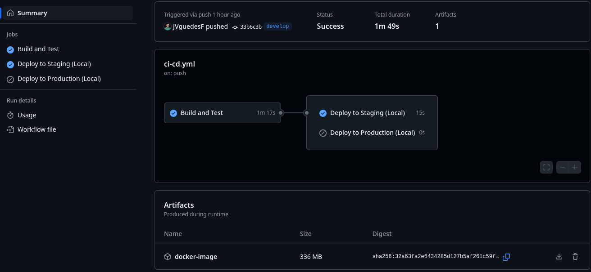  
*Descrição: Etapa de build and test com staging sendo executada com sucesso.*

### 1.1.2 Etapa de Build Production
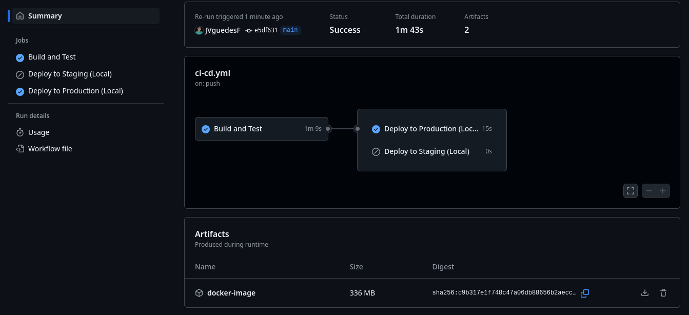  
*Descrição: Etapa de build and test com production sendo executada com sucesso.*

### 1.2. Etapa de Build and Test
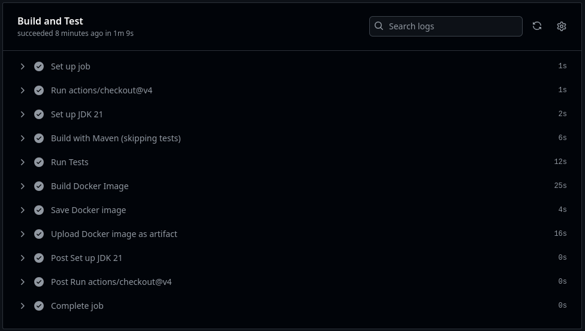  
*Descrição: Testes sendo executados com sucesso.*

### 1.3. Deploy em Staging
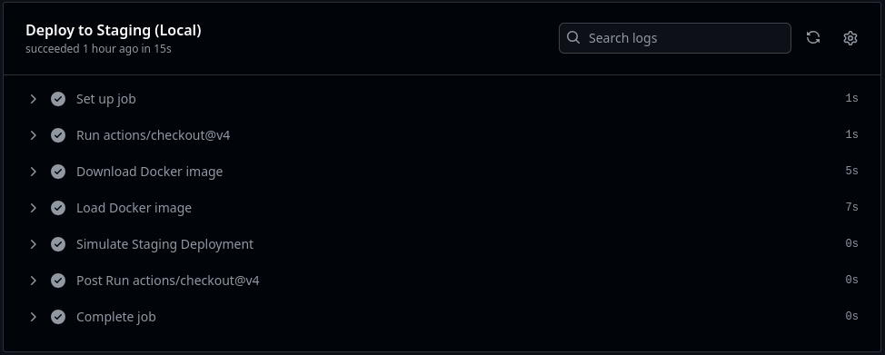  
*Descrição: Implantação bem-sucedida no ambiente de staging.*

### 1.4. Deploy em Produção
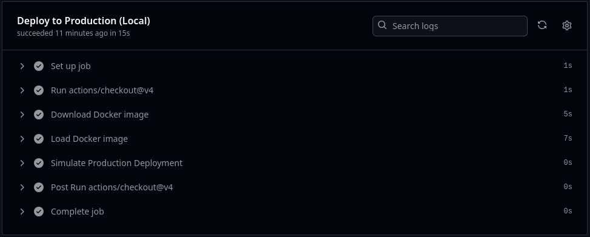  
*Descrição: Implantação bem-sucedida no ambiente de produção.*

---

## 2. Containerização

### 2.1. Imagens Docker
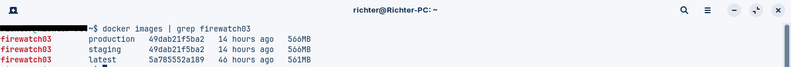  
*Descrição: Imagens Docker criadas para ambientes de staging e production. Nota: Verificar possível typo no comando `grep firewatch83` (deve ser `firewatch03`).*

### 2.2. Containers em Execução
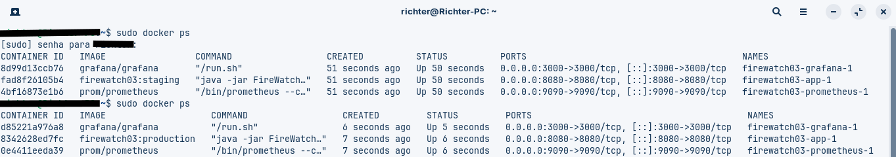  
*Descrição: Containers Docker em execução (app, Prometheus e Grafana). Observar formatação da tabela na imagem.*

### 2.3.1 Build da Imagem Docker Staging
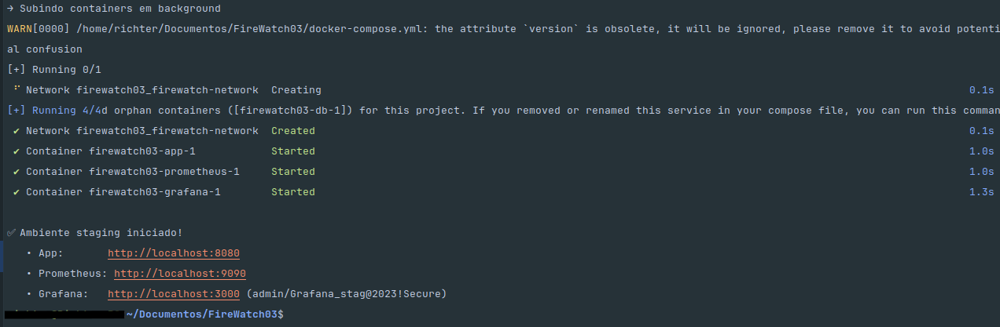  
*Descrição: Log de build da imagem de staging com aviso sobre `version` obsoleto no compose.*

### 2.3.2 Build da Imagem Docker Production
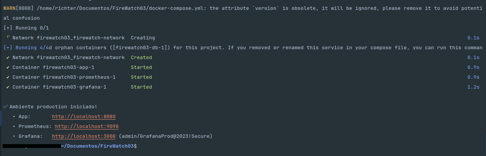  
*Descrição: Log de build da imagem de production com aviso semelhante ao staging.*

---

## 3. Monitoramento

### 3.1. Prometheus
#### 3.1.1 Targets
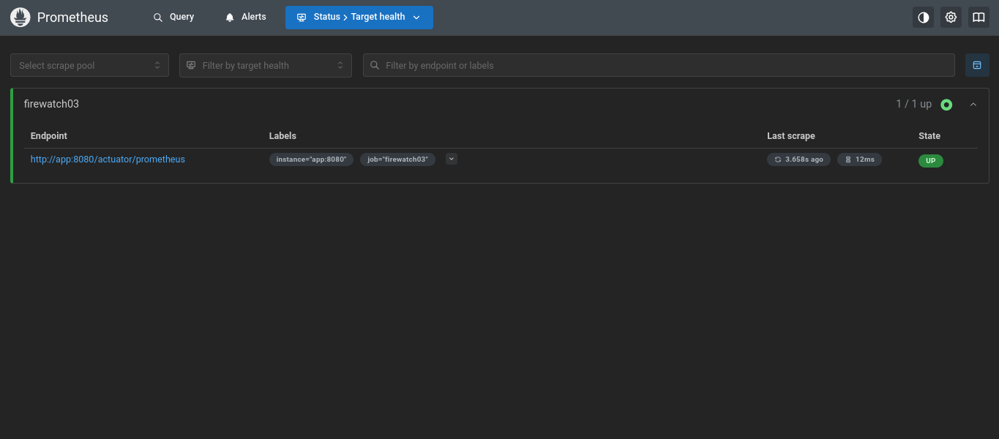  
*Descrição: FireWatch03 listado como alvo no Prometheus.*

#### 3.1.2 Métricas
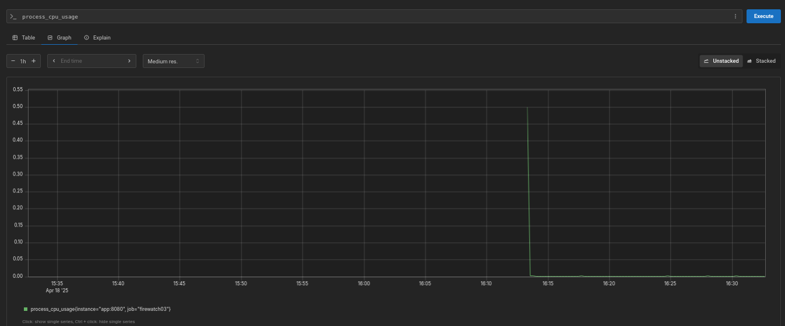  
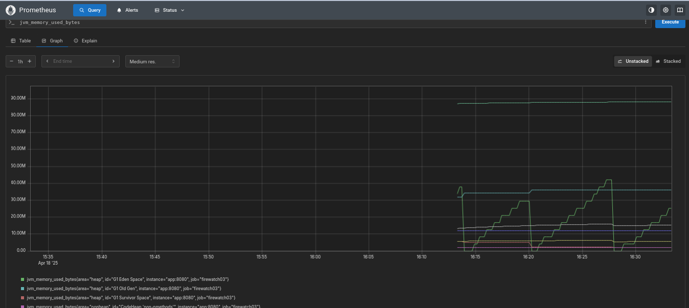  
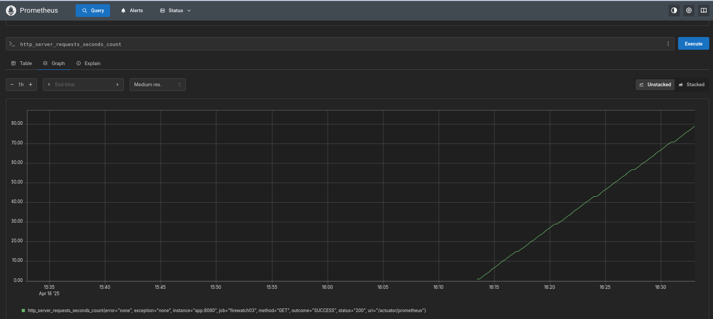  
*Descrição: Dados coletados pelo Prometheus em três partes.*

### 3.2. Grafana
#### 3.2.1 Dashboard de Sistema
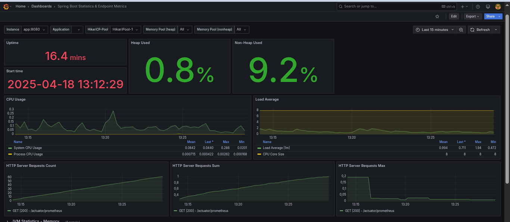  
*Descrição: Dashboard "Spring Boot 2.1 System Monitor".*

#### 3.2.2 Métricas de Performance
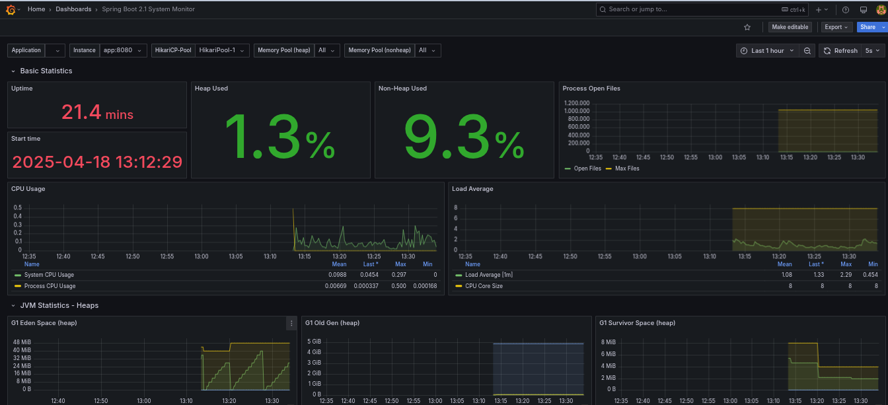  
*Descrição: Dashboard "Spring Boot Endpoint Metrics".*