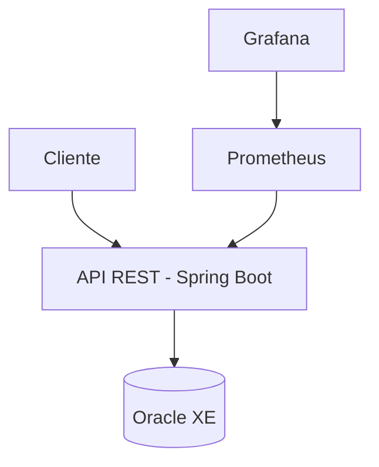

# FireWatch03 - Sistema de Monitoramento para Cidades Inteligentes

## Visão Geral

FireWatch03 é uma aplicação moderna de monitoramento urbano focada na detecção e gestão de incêndios em áreas urbanas. Este projeto implementa uma arquitetura baseada em práticas DevOps, garantindo integração contínua, entrega contínua e monitoramento em tempo real.

## Objetivos do Projeto

- Criar um sistema de monitoramento escalável para cidades inteligentes
- Implementar práticas modernas de DevOps
- Automatizar processos de integração e entrega
- Fornecer monitoramento contínuo de métricas da aplicação

## Arquitetura Simplificada

## Estrutura da Documentação

Esta documentação está organizada nas seguintes seções:

- **Sobre o Projeto**: Detalhes sobre arquitetura e tecnologias utilizadas
- **Pipeline CI/CD**: Detalhamento do processo de CI/CD implementado
- **Containerização e Orquestração**: Abordagem de containerização adotada
- **Evidências e Execução**: Capturas de tela e comprovações de funcionamento
- **Equipe**: Membros e contribuições

## Tecnologias Utilizadas

- **Backend**: Java Spring Boot 3.3.4
- **Banco de Dados**: Oracle XE 21
- **CI/CD**: GitHub Actions
- **Containerização**: Docker
- **Orquestração**: Docker Compose
- **Monitoramento**: Prometheus e Grafana
- **Segurança**: Spring Security com JWT

## Como Utilizar Esta Documentação

Navegue pelo menu lateral para acessar as diferentes seções da documentação. Cada página fornece informações detalhadas sobre um aspecto específico do projeto FireWatch03.